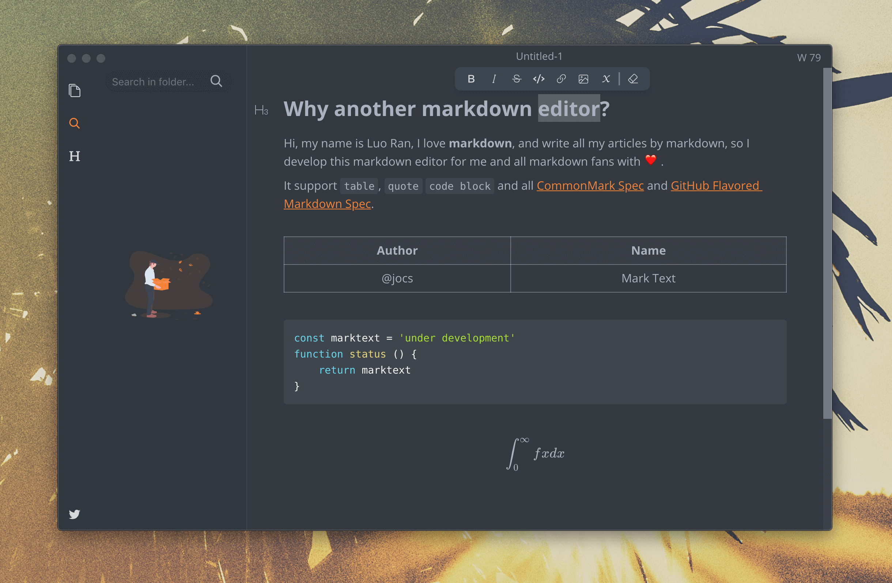
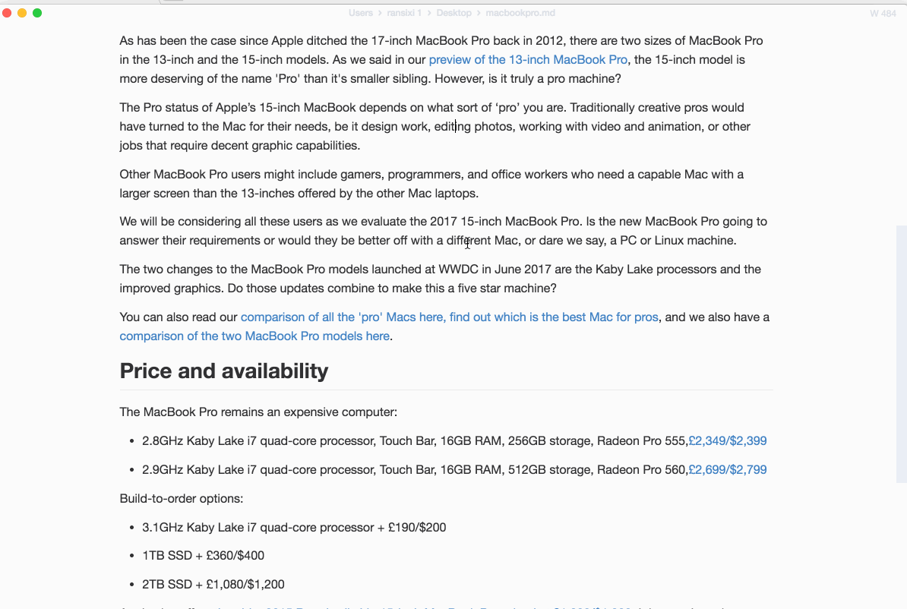

<p align="center"></p>

<h1 align="center">MarkText 中文版</h1>

<div align="center">
  <strong>下一代 Markdown 编辑器</strong><br>
  一款简单而优雅的开源 Markdown 编辑器，专注于速度与可用性。<br>
  <sub>基于 <a href="https://github.com/marktext/marktext">marktext/marktext</a> 深度定制的 Windows 64位汉化版本</sub>
</div>

<br>

<div align="center">
  <a href="LICENSE">
    
  </a>
  <a href="https://github.com/vvangpc/marktext-cn/actions/workflows/build.yml">
    
  </a>
  <a href="https://github.com/vvangpc/marktext-cn/actions/workflows/release.yml">
    
  </a>
</div>

<br>

---

## 关于本项目

本项目 (`vvangpc/marktext-cn`) 是 [MarkText](https://github.com/marktext/marktext) 的 Windows 专属汉化版，针对国内用户做了以下改造：

| 改动项 | 说明 |
|--------|------|
| **全面汉化** | 菜单栏、右键菜单、首选项界面全部翻译为中文 |
| **精简架构** | 移除 macOS / Linux 构建支持，专注 Windows x64 |
| **云端编译** | GitHub Actions 全自动构建，推送即得 `.exe` 安装包 |

### 已汉化内容

- **菜单栏**：文件、编辑、格式、段落、视图、主题、窗口、帮助
- **右键菜单**：编辑区、标签栏、侧边栏文件树
- **首选项**：通用、编辑器、Markdown、图片、拼写、主题、快捷键所有页面

---

## 软件截图



---

## 核心功能

- **所见即所得**（WYSIWYG）实时预览，沉浸式无干扰写作体验
- 支持 [CommonMark](https://spec.commonmark.org/0.29/)、[GitHub Flavored Markdown](https://github.github.com/gfm/) 及 Pandoc 扩展语法
- 数学公式（KaTeX）、Front Matter、Emoji 支持
- 导出为 **HTML** 和 **PDF**
- 六款内置主题：Cadmium Light、Dark、One Dark、Material Dark、Graphite Light、Ulysses Light
- 三种写作模式：**源码模式**、**打字机模式**、**专注模式**
- 支持直接粘贴剪贴板图片

| 源码模式 | 打字机模式 | 专注模式 |
|:---:|:---:|:---:|
|  |  |  |

---

## 下载安装

### 方式一：从 Actions 下载构建产物（推荐）

1. 打开 **[Actions 页面](https://github.com/vvangpc/marktext-cn/actions)**
2. 点击最新成功的 **Release** 或 **Build** 工作流
3. 滚动到底部 **Artifacts** 区域
4. 下载 **`marktext-setup-windows`**（含 NSIS 安装包）

> 构建产物保留 **30 天**，请及时下载。

### 方式二：触发新构建

向 `master` 分支提交任意更改，或推送 `release-v*` 分支，即可自动触发构建：

```bash
git push origin master
# 或
git checkout -b release-v1.0.0 && git push origin release-v1.0.0
```

---

## 本地开发

### 环境要求

| 依赖 | 版本要求 |
|------|---------|
| 操作系统 | Windows 10 / 11 (x64) |
| Node.js | v16.x（推荐 16.20.2） |
| Python | 3.11（**不支持** 3.12+，需含 distutils） |
| Yarn | ^1.22 |
| C++ 编译工具 | Visual Studio 2019 / 2022，勾选"使用C++的桌面开发" |

### 快速开始

```bash
# 克隆仓库
git clone https://github.com/vvangpc/marktext-cn.git
cd marktext-cn

# 安装依赖
yarn install --check-files --frozen-lockfile

# 启动开发模式（热更新）
yarn dev

# 打包 Windows 安装包
yarn release:win
```

打包产物输出到 `build/` 目录：
- `marktext-setup.exe` — NSIS 安装包
- `marktext-x64-win.zip` — 便携压缩包

---

## CI/CD 工作流

| 工作流 | 触发条件 | 产出 |
|--------|---------|------|
| `build.yml` | 推送到 master | 构建校验 + `MarkText-Windows-Prebuild` |
| `release.yml` | 推送到 master 或 `release-v*` 分支 | `marktext-setup-windows` + `marktext-windows-zip` |

---

## 鸣谢与许可

本项目基于 [Jocs](https://github.com/Jocs) 及 [MarkText Contributors](https://github.com/marktext/marktext/graphs/contributors) 的出色工作。

**授权协议**：[MIT License](LICENSE)
